# CRE Advantage

CRE Advantage is a full-stack mobile responsive application for Commercial Real Estate Brokers. The application gives Brokers an advantage in the market by helping them to keep track of property information, property notes, daily and weekly tasks and property locations through Google Maps API.

# Build Tools
<ul>
<li>Javascript</li>
<li>HTML5</li>
<li>CSS</li>
<li>Bootstrap</li>
<li>PostgreSQL</li>
<li>Knex</li>
<li>Express</li>
<li>Authentication: bcrypt</li>
<li>Vue.js</li>
<li>Google Places/Maps API</li>
</ul>

# Wireframe

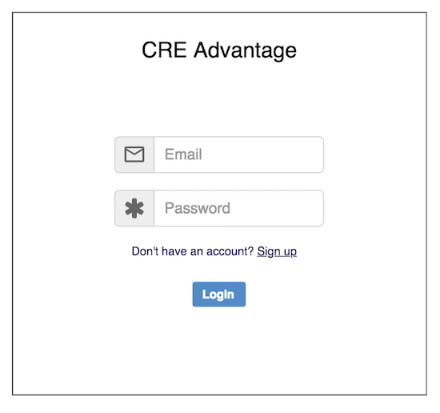
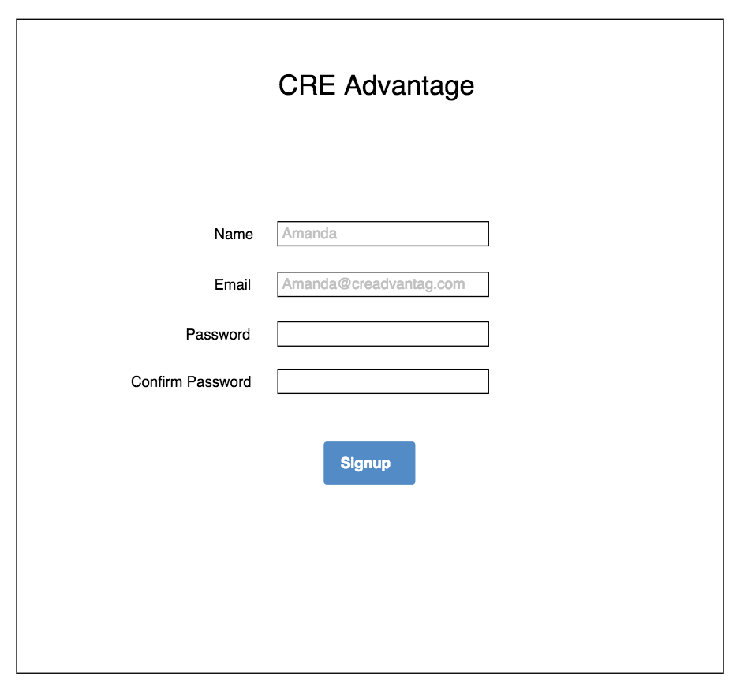
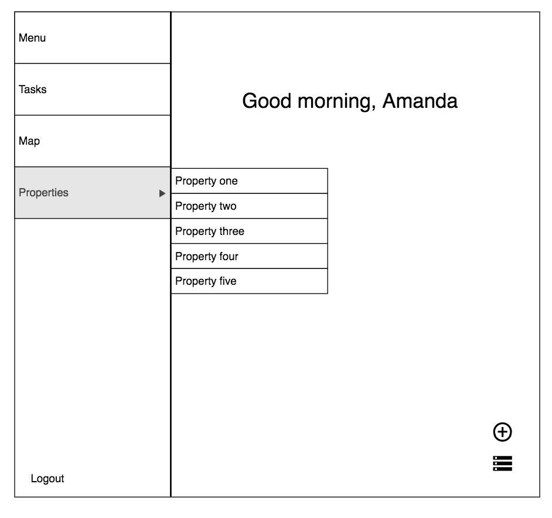
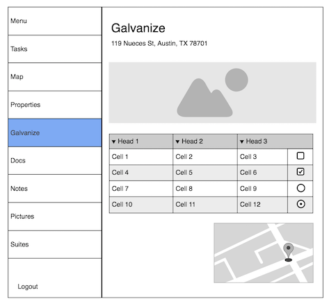
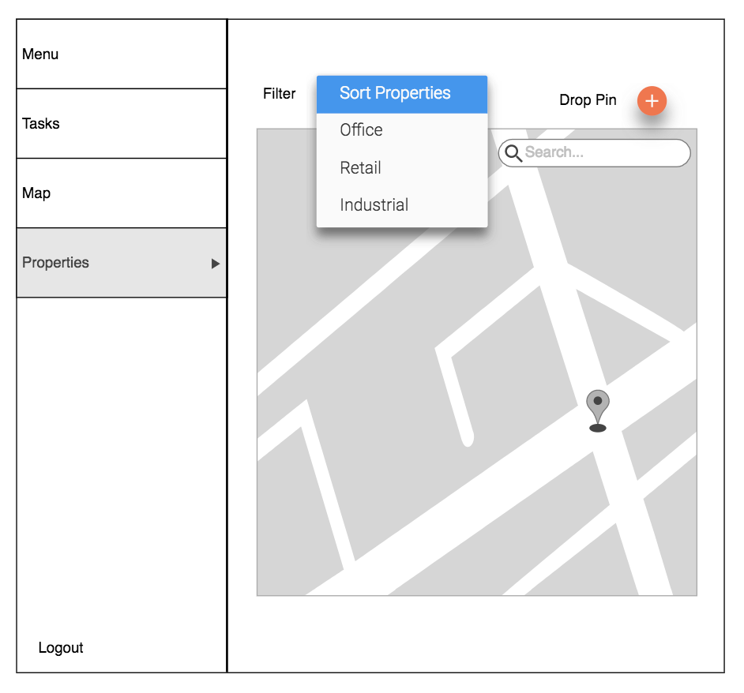
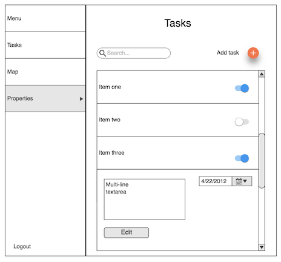

# ERD
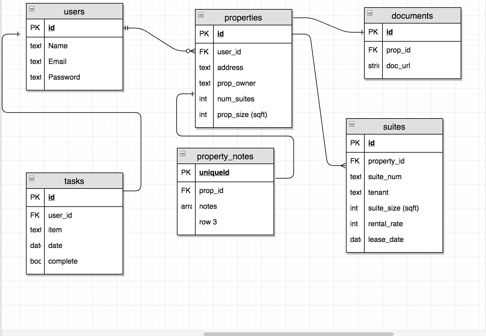

# Web Application

  
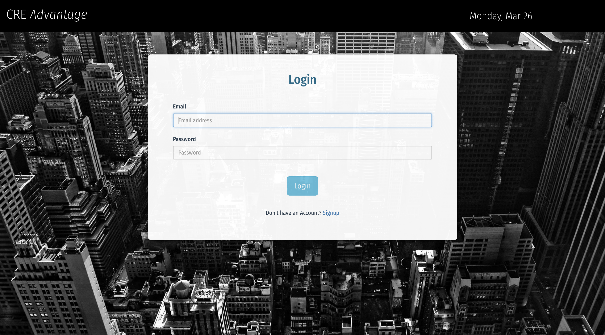
  
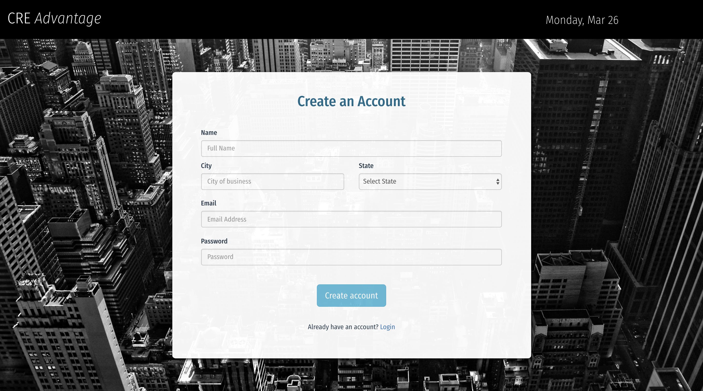
  
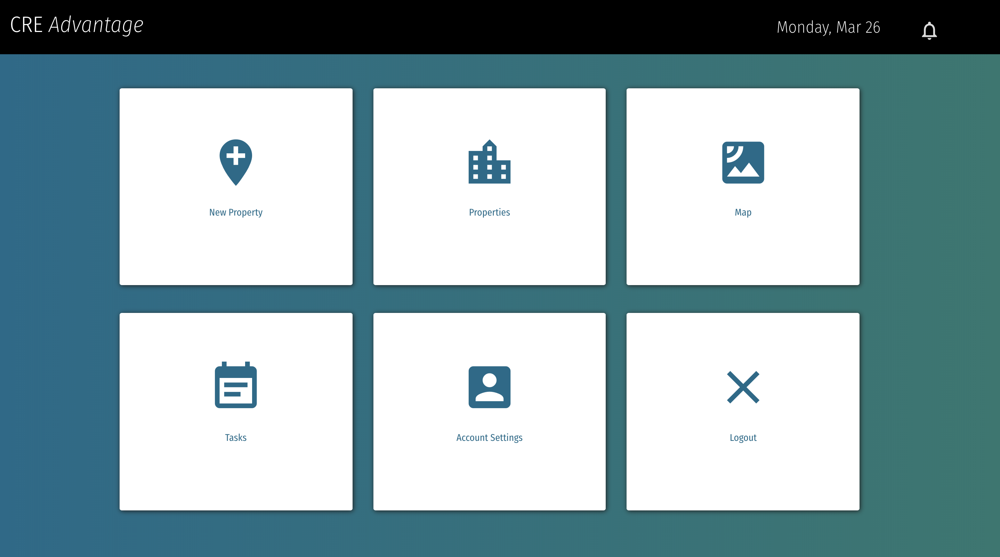
  
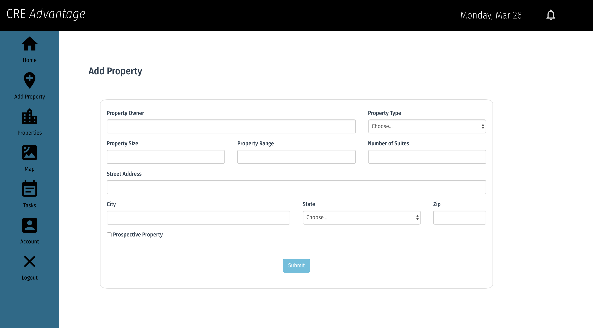
  
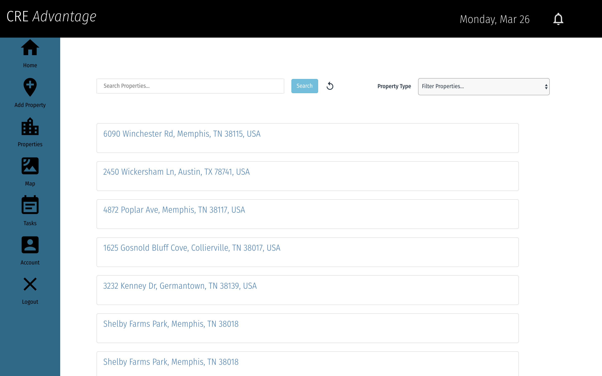
  
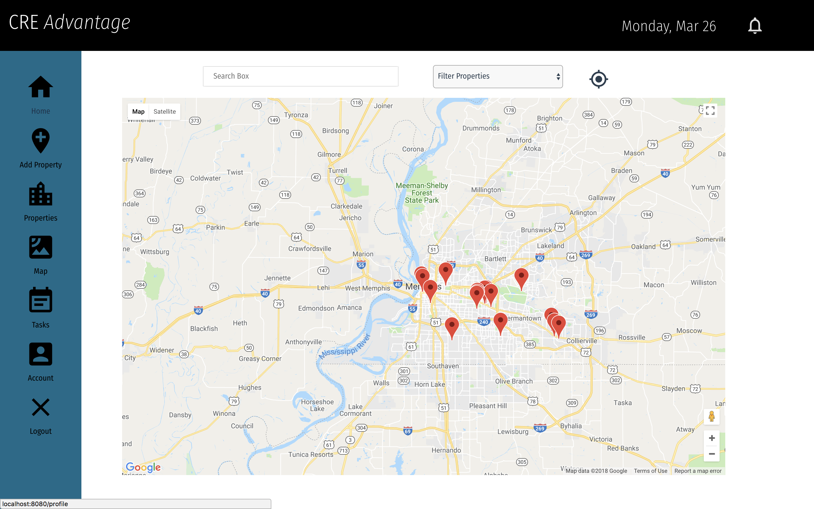
  

  
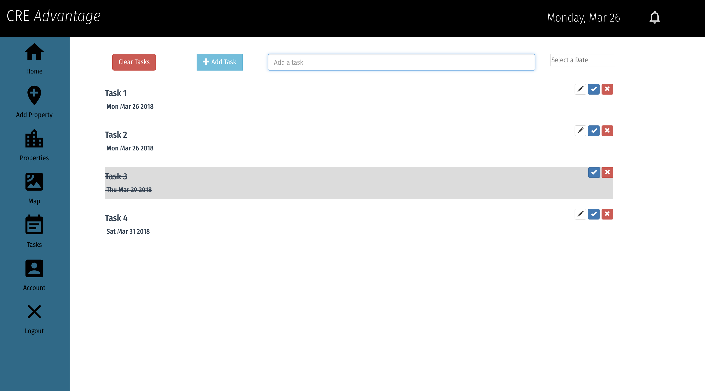
  

  

# Mobile Responsive Application

<table>
<tr>
<td>
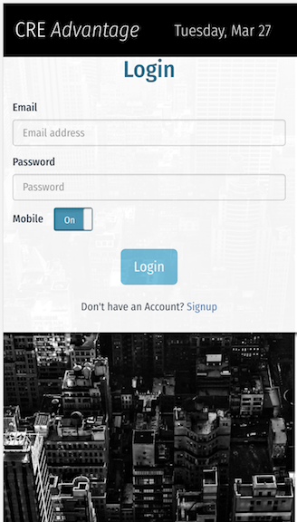
</td>
<td>
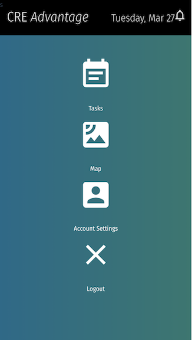
</td>
<td>
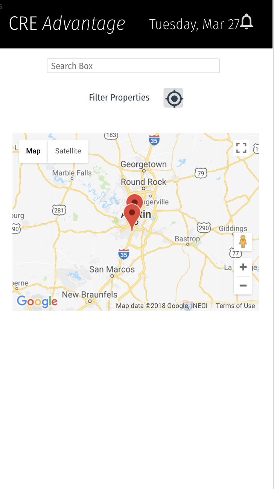
</td>
</tr>
<tr>
<td>
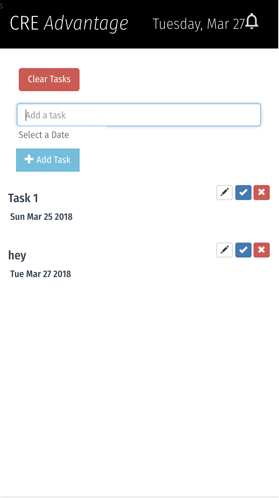
</td>
<td>
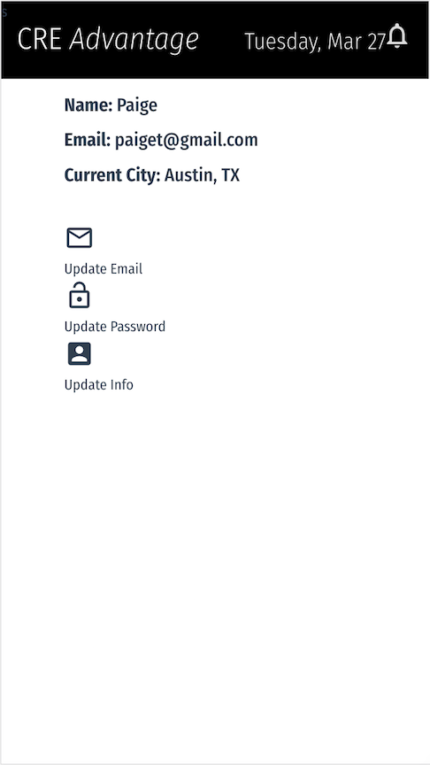
</td>
</tr>
</table>

  

<b>Created by:
Paige Throckmorton and Melissa Warren
</b>

